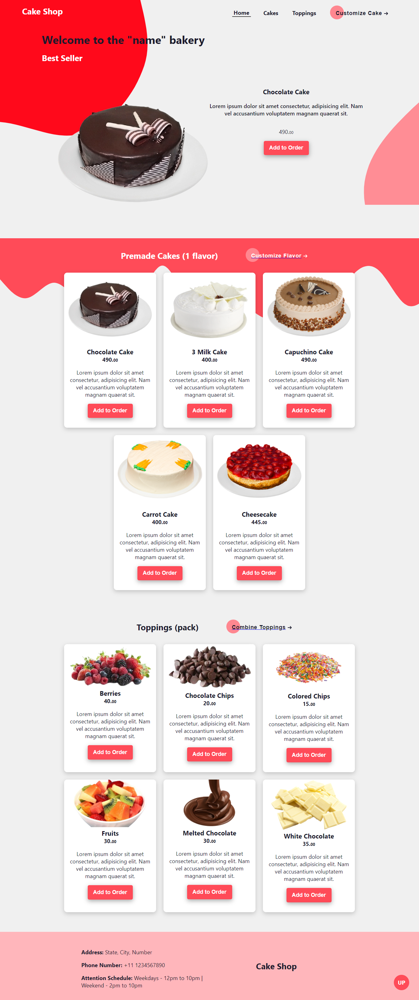
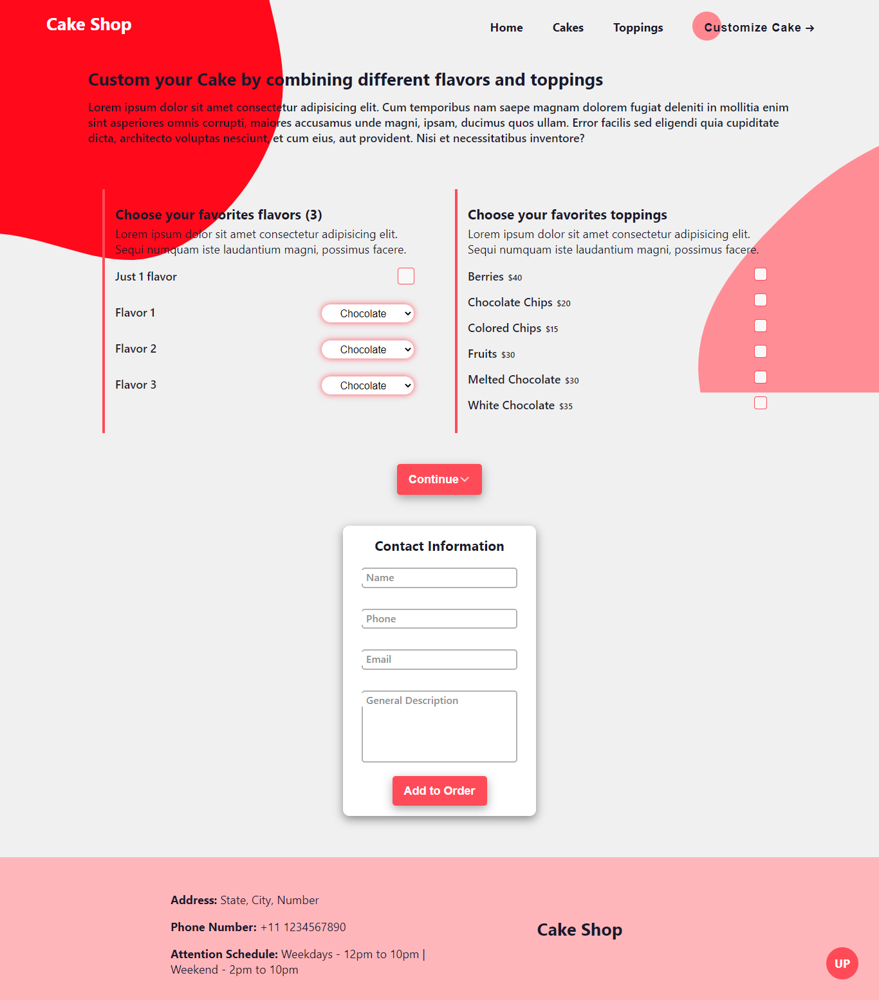
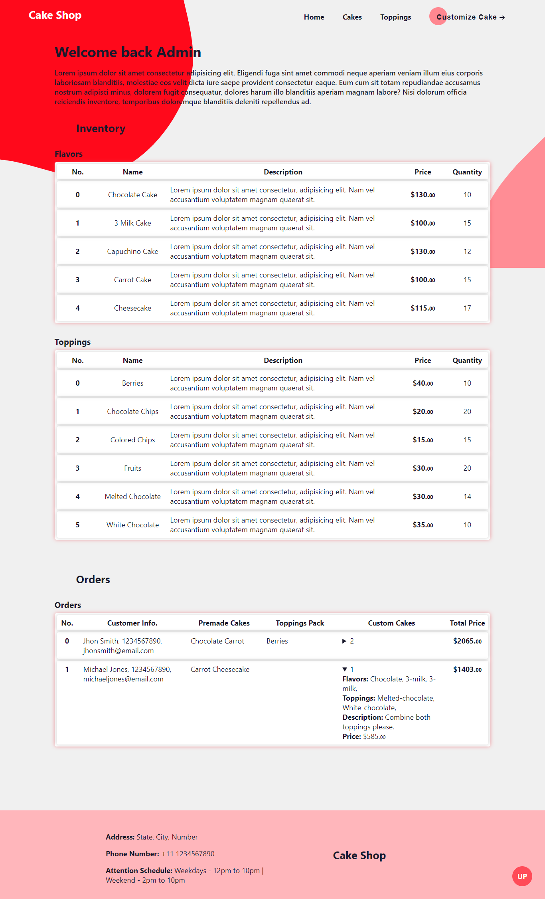
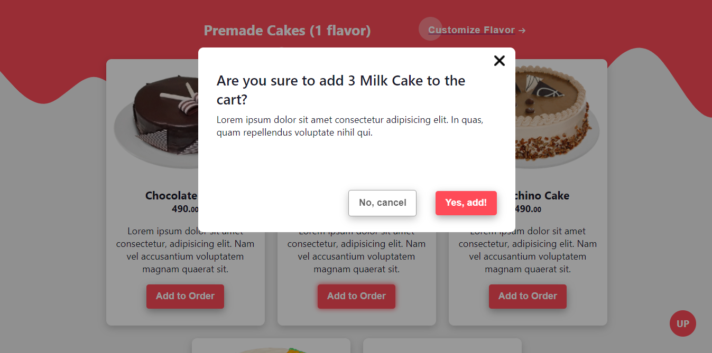

# 05 - VueJS
Código y capturas de la misión VueJS.

1. [Capturas de pantalla (archivos)](./Capturas)

## Project setup
```
npm install
```

### Compiles and hot-reloads for development
```
npm run serve
```

### Compiles and minifies for production
```
npm run build
```

### Capturas de Pantalla

Página principal


Página de personalización


Página del administrador


Modal alert
